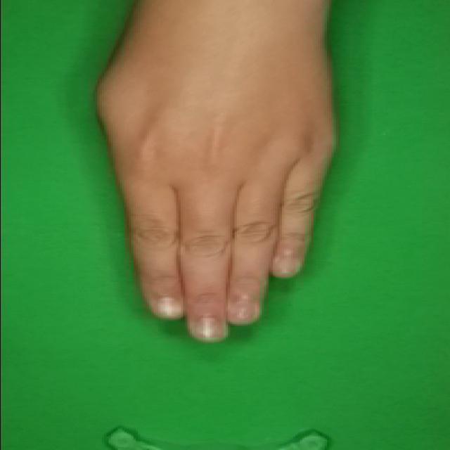

# 가위바위보 이미지 분류 프로젝트

PyTorch와 Vision Transformer (ViT)를 사용한 가위바위보 이미지 분류 모델

## 데이터셋 예시

이 프로젝트는 녹색 배경에서 촬영된 손 제스처 이미지를 사용하여 가위, 바위, 보를 분류합니다.

### 학습 데이터 샘플

<div align="center">

| 바위 (Rock) | 보 (Paper) | 가위 (Scissors) |
|:---:|:---:|:---:|
|  |  |  |
| 주먹을 쥔 형태 | 손바닥을 편 형태 | 두 손가락을 편 형태 |

</div>

**데이터셋 특징:**
- 녹색 크로마키 배경 사용으로 손 영역 분리 용이
- 다양한 각도와 손 모양 포함
- 224x224 해상도로 리사이징하여 학습
- Data Augmentation 적용 (회전, 밝기 조정, 정규화 등)

## 프로젝트 구조

```
AI/
├── extract.py          # 데이터셋 압축 해제 모듈
├── dataset.py          # 데이터 로딩 및 전처리 모듈
├── model.py            # 모델 정의 (ViT, ResNet50)
├── trainer.py          # 학습 및 평가 모듈
├── main.py             # 메인 실행 파일
└── README.md           # 프로젝트 설명서
```

## 주요 기능

### 1. dataset.py - 데이터 관리
- `RockPaperScissorsDataModule`: 가위바위보 데이터셋 로딩 및 전처리
  - 데이터 증강 (Data Augmentation)
  - Train/Validation/Test DataLoader 제공
  - 샘플 이미지 시각화

### 2. model.py - 모델 아키텍처
- `MyVit_b_16`: Vision Transformer (ViT-B/16) 기반 모델
- `MyResNet50`: ResNet50 기반 모델
- Fine-tuning 및 Feature Extraction 모드 지원

### 3. trainer.py - 학습 관리
- `RockPaperScissorsTrainer`: 학습, 검증, 테스트 통합 클래스
  - 에포크별 학습 및 검증
  - 학습 히스토리 추적
  - 모델 저장/로드 기능

### 4. main.py - 실행 파이프라인
- 데이터 로딩
- 모델 초기화
- 학습 실행
- 테스트 평가
- 모델 저장

## 설치 방법

### 1. 가상환경 생성 및 활성화
```bash
python -m venv venv
.\venv\Scripts\activate  # Windows
```

### 2. 필요한 패키지 설치

#### 한 번에 설치
```bash
pip install torch torchvision matplotlib pillow numpy
```

#### 개별 패키지 설명
```bash
# PyTorch - 딥러닝 프레임워크
pip install torch

# TorchVision - 이미지 처리 및 사전학습 모델 제공
pip install torchvision

# Matplotlib - 학습 히스토리 시각화
pip install matplotlib

# Pillow - 이미지 로딩 및 전처리
pip install pillow

# NumPy - 수치 연산 (선택사항, PyTorch에서 자동 설치)
pip install numpy

# Roboflow - 데이터셋 다운로드용 (선택사항)
pip install roboflow
```

#### 필수 패키지 목록
- **torch**: PyTorch 딥러닝 프레임워크
- **torchvision**: ViT, ResNet50 등 사전학습 모델 및 데이터 변환
- **matplotlib**: 학습 결과 그래프 시각화
- **pillow**: 이미지 파일 로딩 및 처리
- **numpy**: 배열 및 수치 연산 (PyTorch 의존성)
- **roboflow**: 데이터셋 다운로드 (선택사항)

## 사용 방법

### 1. 데이터셋 준비

#### 방법 1: Roboflow에서 다운로드 (권장)
```bash
pip install roboflow
```

```python
from roboflow import Roboflow

rf = Roboflow(api_key="E8WIPjtVKD19G5AAvr5A")
project = rf.workspace("cpecgm3").project("rock-paper-scissor-p13xv")
version = project.version(2)
dataset = version.download("folder")
```

#### 방법 2: 압축 파일 해제
데이터셋 압축 파일이 있는 경우 `main.py`에서 주석을 해제:
```python
import extract
extract.extract_data()
```

### 2. 학습 실행
```bash
python main.py
```

### 3. 모델 선택
`main.py`에서 모델을 선택할 수 있습니다:

**Vision Transformer 사용:**
```python
from model import MyVit_b_16

model = MyVit_b_16(
    num_classes=3,
    feature_extractor=False,  # Fine-tuning
    pretrained=True
)
```

**ResNet50 사용:**
```python
from model import MyResNet50

model = MyResNet50(
    num_classes=3,
    feature_extractor=False,  # Fine-tuning
    pretrained=True
)
```

### 4. 학습 모드 선택

**Fine-tuning (권장):**
- 모든 레이어 학습
- Learning rate: 1e-6
```python
model = MyVit_b_16(feature_extractor=False)
trainer = RockPaperScissorsTrainer(model, learning_rate=1e-6)
```

**Feature Extraction:**
- 마지막 레이어만 학습
- Learning rate: 1e-4
```python
model = MyVit_b_16(feature_extractor=True)
trainer = RockPaperScissorsTrainer(model, learning_rate=1e-4)
```

## 하이퍼파라미터 설정

`main.py` 파일 상단에서 모든 하이퍼파라미터를 쉽게 조정할 수 있습니다:

```python
# 데이터 설정
BATCH_SIZE = 32                    # 배치 크기
IMAGE_SIZE = (224, 224)           # 이미지 크기
NUM_WORKERS = 0                    # 데이터 로딩 워커 수

# 학습 설정
EPOCHS = 10                        # 학습 에포크 수
LEARNING_RATE = 1e-6              # 학습률
FEATURE_EXTRACTOR = False         # False: Fine-tuning, True: Feature Extractor

# 옵티마이저 설정
OPTIMIZER = 'adam'                 # 'adam', 'adamw', 'sgd'
WEIGHT_DECAY = 0                   # L2 regularization (0 = 사용 안 함)
MOMENTUM = 0.9                     # SGD 사용 시 모멘텀

# Learning Rate Scheduler 설정
USE_SCHEDULER = False              # True: 스케줄러 사용, False: 사용 안 함
SCHEDULER_NAME = 'step'            # 'step', 'cosine', 'reduce'
SCHEDULER_STEP_SIZE = 5            # Step/Reduce: N 에포크마다 감소, Cosine: 주기
SCHEDULER_GAMMA = 0.1              # 학습률 감소 비율

# Loss Function 설정
LOSS_FUNCTION = 'crossentropy'     # 'crossentropy', 'focal', 'label_smoothing'
LABEL_SMOOTHING = 0.0              # Label Smoothing 값 (0.0 = 사용 안 함, 0.1 권장)
```

### 권장 설정

**Fine-tuning (전체 모델 학습):**
```python
LEARNING_RATE = 1e-6
FEATURE_EXTRACTOR = False
OPTIMIZER = 'adamw'
WEIGHT_DECAY = 0.01
USE_SCHEDULER = True
SCHEDULER_NAME = 'cosine'
EPOCHS = 10-20
```

**Feature Extraction (Classifier만 학습):**
```python
LEARNING_RATE = 1e-4
FEATURE_EXTRACTOR = True
OPTIMIZER = 'adam'
WEIGHT_DECAY = 0
USE_SCHEDULER = False
EPOCHS = 5-10
```

### 옵티마이저 선택 가이드

- **Adam**: 일반적으로 가장 좋은 성능, 빠른 수렴
- **AdamW**: Adam + Weight Decay, Fine-tuning에 권장
- **SGD**: 전통적인 방법, Momentum과 함께 사용

### Learning Rate Scheduler 가이드

- **StepLR**: N 에포크마다 학습률을 gamma 비율로 감소
  - `SCHEDULER_STEP_SIZE=5, SCHEDULER_GAMMA=0.1` → 5 에포크마다 LR × 0.1
- **CosineAnnealingLR**: Cosine 함수 형태로 학습률 감소
  - 부드러운 학습률 변화, Fine-tuning에 효과적
- **ReduceLROnPlateau**: Validation loss가 개선되지 않을 때 학습률 감소
  - 자동으로 최적 시점에 학습률 조정

### Loss Function 가이드

- **CrossEntropy**: 기본 분류 손실 함수
  - 일반적인 상황에서 사용
- **Label Smoothing**: 과적합 방지를 위한 손실 함수
  - `LABEL_SMOOTHING=0.1` 권장 (너무 확실하게 예측하는 것을 방지)
  - Fine-tuning에 효과적
- **Focal Loss**: 불균형 데이터셋을 위한 손실 함수
  - 어려운 샘플에 더 집중
  - 클래스 불균형이 심할 때 유용

## 모델 저장 및 로드

### 저장
```python
trainer.save_model('rock_paper_scissors_model.pth')
```

### 로드
```python
trainer.load_model('rock_paper_scissors_model.pth')
```

## 출력 예시

```
============================================================
1. 데이터 로딩 중...
============================================================
using Pytorch version: 2.x.x, Device: cuda

클래스 개수: 3
클래스 이름: ['paper', 'rock', 'scissors']

============================================================
2. 모델 초기화 중...
============================================================
Using device: cuda
PyTorch version: 2.x.x
Model: MyVit_b_16
Mode: Fine-tuning

============================================================
3. 학습 시작...
============================================================
Loss Function: CROSSENTROPY
Optimizer: ADAM
Learning Rate: 1e-06
Weight Decay: 0
Batch Size: 32
Epochs: 10

Epoch [1/10]
  Train - Loss: 0.5234, Accuracy: 78.45%
  Val   - Loss: 0.3421, Accuracy: 85.23%

...

============================================================
4. 학습 히스토리 시각화 중...
============================================================
Training history plot saved to training_history.png

============================================================
5. 테스트 평가 중...
============================================================
=== Test Results ===
Accuracy: 89.34%
Loss: 0.2876

============================================================
6. 모델 저장 중...
============================================================
Model saved to rock_paper_scissors_model.pth

============================================================
학습 완료!
============================================================
```

## 학습 결과 시각화

학습 완료 후 `training_history.png` 파일이 생성됩니다. 이 파일에는:
- **Loss Trend**: 에포크별 학습/검증 손실 그래프
- **Accuracy Trend**: 에포크별 학습/검증 정확도 그래프

두 개의 그래프가 나란히 표시되어 과적합 여부를 쉽게 확인할 수 있습니다.

## 클래스 정보

- **paper**: 보
- **rock**: 바위
- **scissors**: 가위

## 참고사항

- GPU 사용 가능 시 자동으로 CUDA 사용
- 학습 히스토리는 `trainer.get_history()`로 확인 가능
- 샘플 이미지 시각화는 `data_module.visualize_batch()` 사용

## 라이선스

Educational Purpose
